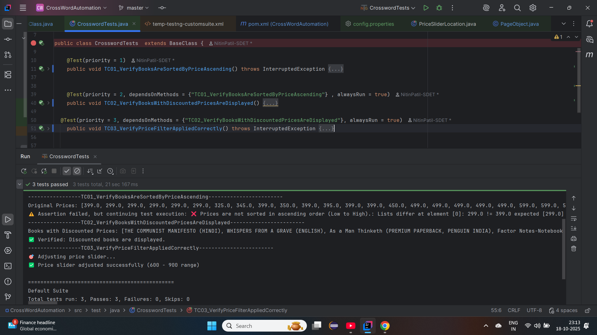

---
# 🚀 CrossWord UI Automation Framework


## About Project
This project is an automation framework built using **Java, Selenium, TestNG**, and integrated 
with **BrowserStack Grid** for remote execution.


[](https://www.oracle.com/java/)
[](https://www.selenium.dev/)
[](https://maven.apache.org/)
[](https://testng.org/)
[](https://www.docker.com/)
[](https://www.jenkins.io/)
[](https://github.com/NitinPatil-SDET/OpenCartUIAutomation)


---

## 📌 Overview

This project is a **Selenium Test Automation Framework** built for automating the **Crossword Bookstore** website using **Java, Selenium, TestNG**, and **Maven**, integrated with **BrowserStack Grid** for cross-browser and parallel execution.

The framework validates key e-commerce functionalities such as:

* ✅ Sorting books by **Price: Low to High**
* ✅ Displaying books with **discounted prices**
* ✅ Applying and verifying **price filters**

---

## 📂 Project Structure

```

CrossWordAutomation
│
├── ProjectDoc/                        → Test reports & screenshots
│   ├── Browserstack Test Report.pdf
│   ├── Browserstack Insights.pdf
│   └── LocalExecution.png
│
├── src/
│   ├── main/java/org/example/         → Main Java files
│   │   └── Main.java
│   │
│   └── test/
│       ├── java/                      → Test & page object classes
│       │   ├── BaseClass.java
│       │   ├── CrosswordTests.java
│       │   ├── PageObject.java
│       │   └── PriceSliderLocation.java
│       │
│       └── resources/
│           └── config.properties       → BrowserStack & environment configs
│
├── pom.xml                            → Maven dependencies
├── .gitignore                         → Git ignored files
└── target/                            → Compiled output

````

---

## ⚙️ Tech Stack

* **Language**: Java  
* **Build Tool**: Maven  
* **Test Framework**: TestNG  
* **Automation Tool**: Selenium WebDriver  
* **Execution Grid**: BrowserStack Cloud  
* **Design Pattern**: Page Object Model (POM)  
* **IDE**: IntelliJ IDEA  

---


---

## 🧪 Test Cases Implemented

* **TC01_VerifyBooksAreSortedByPriceAscending** → Verify sorting functionality by price (Low → High)
* **TC02_VerifyBooksWithDiscountedPricesAreDisplayed** → Validate discounted books are displayed correctly
* **TC03_VerifyPriceFilterAppliedCorrectly** → Ensure books are filtered according to selected price range

---

## 🛠️ Setup & Execution

### 1️⃣ Clone the repository

```bash
git clone https://github.com/NitinPatil-SDET/CrossWordAutomation.git
cd CrossWordAutomation
```

### 2️⃣ Install dependencies

```bash
mvn clean install
```

### 3️⃣ Configure Environment

Edit the `src/test/resources/config.properties` file to set your execution mode:

```properties
browser=chrome
browser_version=latest
os=Windows
os_version=11
execution=browserstack
```

*For local run:*

```
execution=local
```

---

## ▶️ Run Tests

Run the full suite:

```bash
mvn clean test
```

Run specific test class:

```bash
mvn -Dtest=CrosswordTests test
```

---

## ☁️ BrowserStack Execution

1. Add your **BrowserStack Username & Access Key** in `config.properties`
2. Execute via Maven:

```bash
mvn clean test -Dbrowser=chrome -Dexecution=browserstack
```

3. View reports on [BrowserStack Dashboard](https://www.browserstack.com/automate)

---

## 📊 Reports & Evidence

📁 **ProjectDoc Folder Includes:**

* BrowserStack execution reports
* Insights & local run screenshots



---

## 🧩 Key Features

* 🔸 Cross-browser and cloud-based execution via BrowserStack
* 🔸 Modular design following **Page Object Model (POM)**
* 🔸 Configurable environment using `config.properties`
* 🔸 Detailed test evidence and reports in **ProjectDoc** folder

---

## 🧱 Future Enhancements

* 📈 Integrate **Allure** or **Extent Reports**
* 🌐 Add **cross-browser and mobile web testing**
* 🔄 Include **CI/CD pipeline integration**
* 🧮 Implement **data-driven testing** (Excel/JSON)

---

## 👩‍💻 Author

### Nitin Patil  

<p align="left">
  <a href="https://github.com/NitinPatil-SDET" target="_blank">
    
  </a>
  <a href="https://www.linkedin.com/in/nitinpatilsdet/" target="_blank">
    
  </a>
  <a href="mailto:nitinpatilsdet@gmail.com">
    
  </a>

---

⭐ **If you find this project helpful, don’t forget to give it a star!**

---


